# fragrance-cluster-analysis
K-means++ clustering on fragrance accords

        
  

## Table of contents
* [General info](#general-info)
* [Technologies](#technologies)
* [Setup](#setup)
* [Screenshots](#screenshots)
* [Results](#results)
* [Status](#status)

## General info
Unsupervised machine learning project with K-Means++ clustering performed on different female fragrances.

## Technologies
Project is created with Python - version: 3.8.5.

Python libraries:
* scikit-learn - version 0.23.2
* pandas - version 1.1.1
* numpy - version 1.19.1
* yellowbrick - version 1.1
* matplotlib - version 3.3.1
* seaborn - version 0.10.1
  
## Setup

Input data: perfume.csv, source: https://www.kaggle.com/sagikeren88/fragrances-and-perfumes

Output data: fragrances.ipynb

## Screenshots

**Objectives**

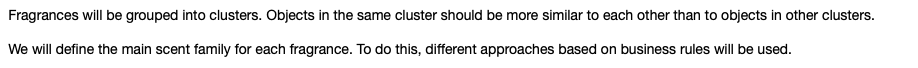

**Project structure**

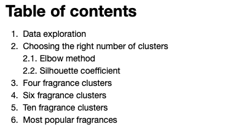

## Results

**Data exploration**

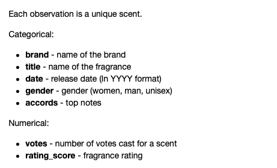

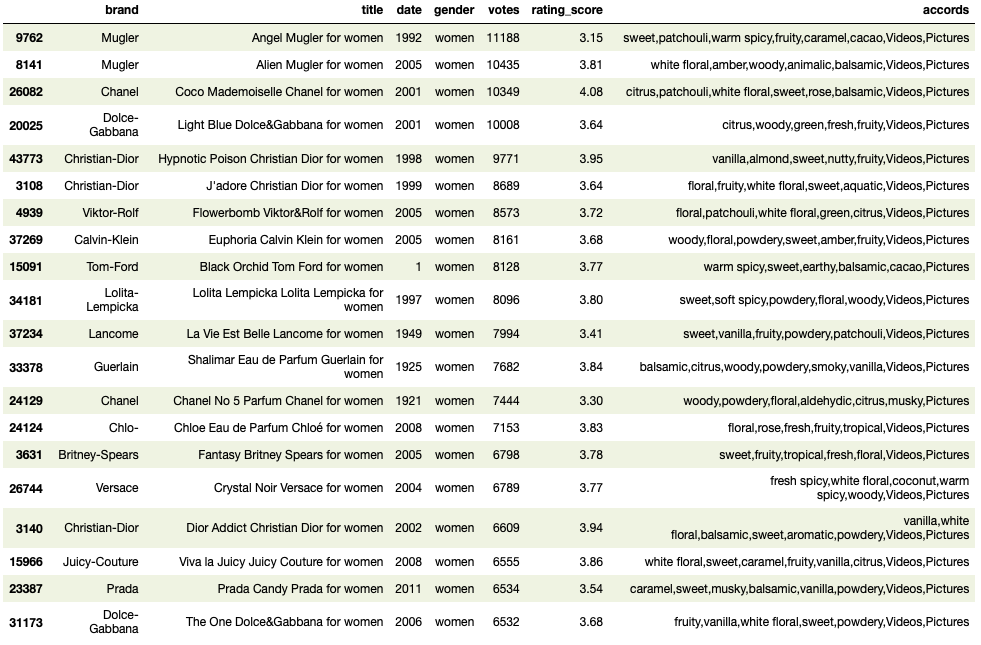

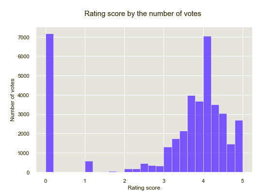

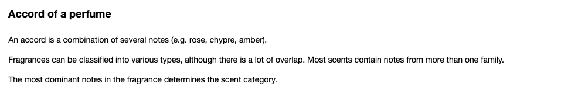

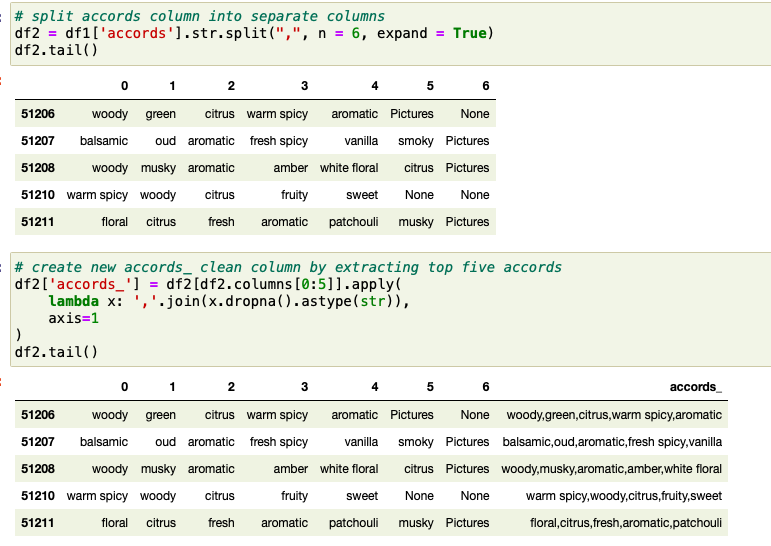

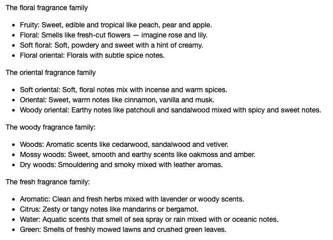

**Choosing the right number of clusters**

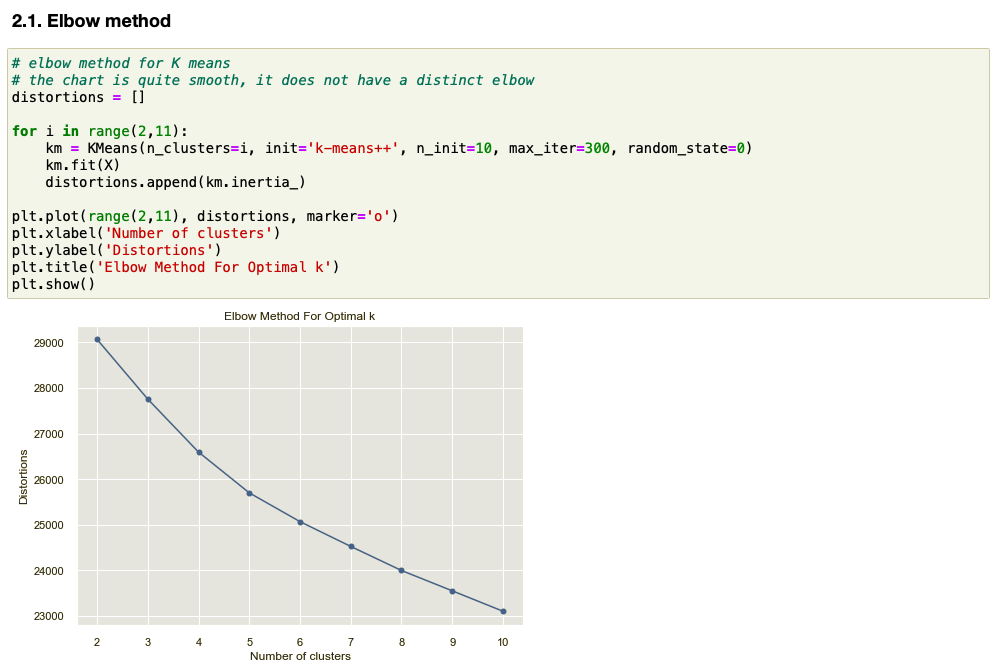

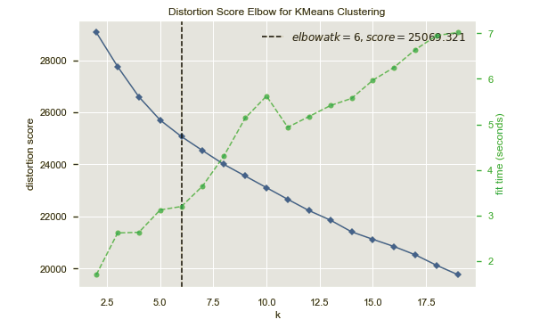

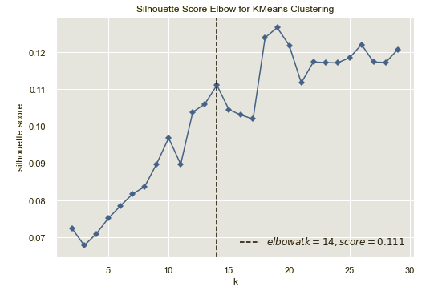

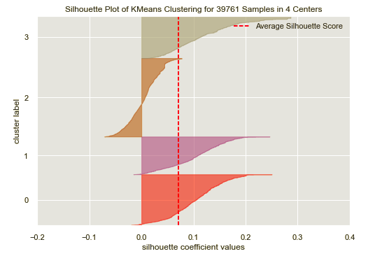

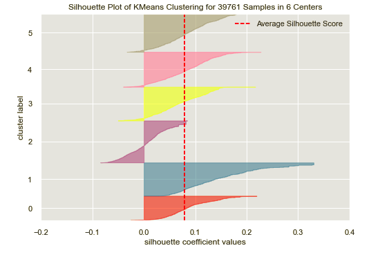

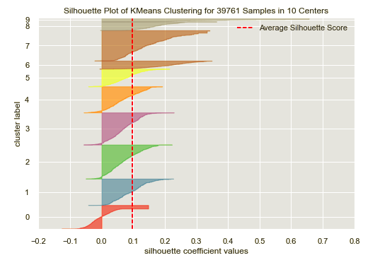

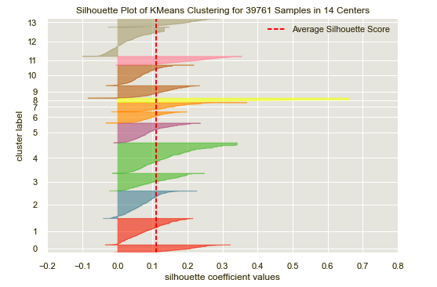

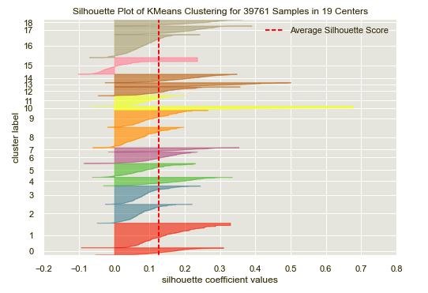

**Four fragrance clusters**

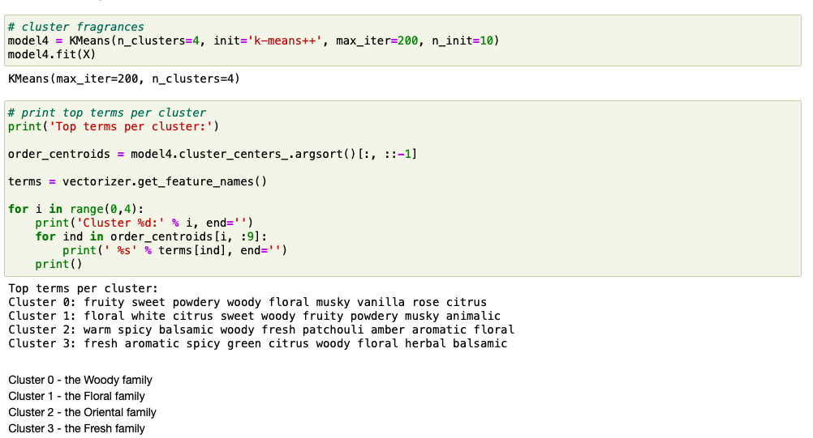

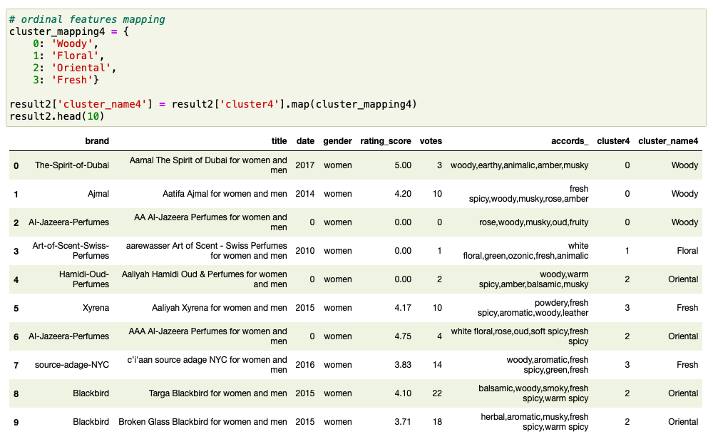

**Most popular fragrances**

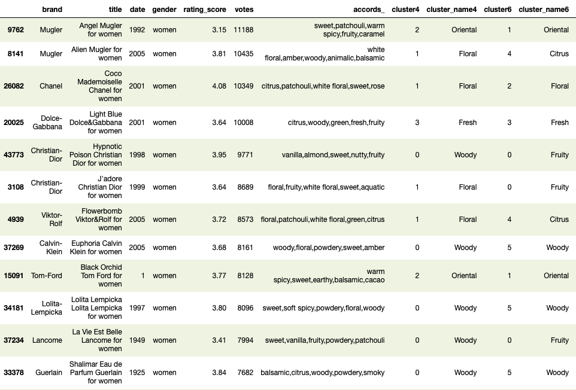

**Conclusions**

## Status
This project is in progress.
