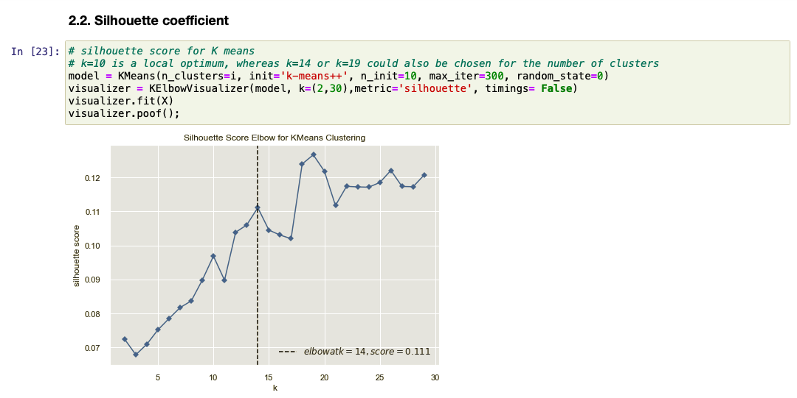

# fragrance-clustering
K-means++ clustering on fragrance accords

        
  

## Table of contents
* [General info](#general-info)
* [Technologies](#technologies)
* [Setup](#setup)
* [Screenshots](#screenshots)
* [Status](#status)

## General info
Unsupervised machine learning project with K-Means++ clustering performed on different female fragrances.

This project is part of my fragrance exploration series:
1. K-means++ clustering on fragrance accords  
https://github.com/katarzynajanicka/fragrance-clustering
2. Agglomerative hierarchical clustering on 39.7K female fragrances  
https://github.com/katarzynajanicka/agglomerative-fragrance-clustering
3. Accords-based recommendation system for female fragrances  
https://github.com/katarzynajanicka/fragrance-finder

## Technologies
Project is created with Python - version: 3.8.2.

Python libraries:
* scikit-learn - version 0.23.2
* pandas - version 1.1.1
* numpy - version 1.19.1
* yellowbrick - version 1.1
* matplotlib - version 3.3.1
* seaborn - version 0.10.1
  
## Setup

Input data: perfume.csv, source: https://www.kaggle.com/sagikeren88/fragrances-and-perfumes

Output data: fragrances.ipynb

## Screenshots

**Objectives**

**Project structure**

## Results

**Data structure**

**Data exploration**

**Choosing the right number of clusters**

**Four fragrance clusters**

**Most popular fragrances**

**Conclusions**

Clustering, like other unsupervised machine learning algorithms, is very exploratory in nature.

The weakness of the K-means algorithm (and its optimized K-means++ version deployed in this analysis) is the need to determine the number of clusters in advance. However, additional metrics such as distortion used in the elbow method or silhouette coefficient may be helpful in choosing the number of clusters a priori. The number of clusters should be primarily determined based on the business needs.

Cluster descriptions show the general, average characteristics of the members of a given cluster (cluster centroids). One cluster may share the same characteristics with other clusters. On the basis of the analyzed data, the division into four categories of perfumes (fresh, floral, oriental and woody) turned out to be the most accurate.

Agglomerative hierarchical clustering technique may be a more correct approach as the different perfumes have a large overlap in fragrance accords. Perfume fragrances usually have the same notes, although they belong to different fragrance families.

## Status
Project completed.
